# Car Booking Test Drive
# Project Introduction

## Title

Car Booking Test Drive - Toyota Yaris Hybrid 2018
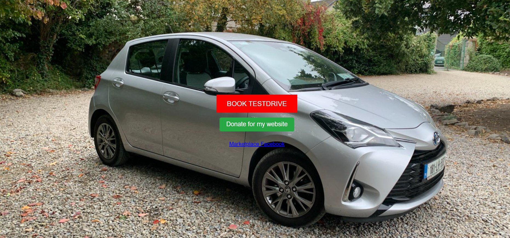

## Description

This project is a simple web application that allows users to book test drives for the Toyota Yaris Hybrid 2018. 
The application simulates a booking system where users can select available time slots, provide personal details, 
and confirm a test drive. It's designed to demonstrate fundamental concepts of web development 
and booking system management, such as user interaction, form handling, and scheduling.

---

### The idea of creating an application

This app was developed to provide flexible and affordable car sales with the ability to book a test drive and make a purchase offer. 
The idea is to create a car model on the website, add pictures, a description of the car and the selling price. 
At this stage, I have developed one variant of the car to demonstrate how the application works. 

---

## Link to Live Site

This site was built using [Heroku](https://car-booking-toyota-11b6aa2e6f11.herokuapp.com/)

## User Experience

### First-Time User Experience

New users are greeted with an attractive design and clear navigation menu. 
Each section provides clear information on the various services related to test drive bookings and car purchase enquiries. 
Clicking on buttons allows users to quickly navigate to the relevant pages for more detailed information.

### Returning User

Regular users can easily find the sections they need with the help of a user-friendly navigation menu. 
The consistent design and layout create a familiar and welcoming environment.

### User Stories 

As a potential customer, I want to know about the possibilities of booking a test drive and buying a car. 
As a visitor, I want to see a visually appealing and easy-to-navigate website. 
As a user interested in booking a test drive, I want to quickly find and fill out the appropriate form.

## Technologies used
- ### Languages:
    
    + [Python 3.8.5](https://www.python.org/downloads/release/python-385/): the primary language used to develop the server-side of the website.
    + [JS](https://www.javascript.com/): the primary language used to develop interactive components of the website.
    + [HTML](https://developer.mozilla.org/en-US/docs/Web/HTML): the markup language used to create the website.
    + [CSS](https://developer.mozilla.org/en-US/docs/Web/css): the styling language used to style the website.

- ### Frameworks and libraries:

    + [Django](https://www.djangoproject.com/): python framework used to create all the logic.

- ### Databases:

    + [SQLite](https://www.sqlite.org/): was used as a development database.
    + [PostgreSQL](https://www.postgresql.org/): the database used to store all the data.

- ### Other tools:

    + [Git](https://git-scm.com/): the version control system used to manage the code.
    + [Pip3](https://pypi.org/project/pip/): the package manager used to install the dependencies.
    + [Gunicorn](https://gunicorn.org/): the web server used to run the website.
    + [Psycopg2](https://www.psycopg.org/): the database driver used to connect to the database.
    + [Django-allauth](https://django-allauth.readthedocs.io/en/latest/): the authentication library used to create the user accounts.
    + [Django-crispy-forms](https://django-cryptography.readthedocs.io/en/latest/): was used to control the rendering behavior of Django forms.
    + [Render](https://pypi.org/project/render/): was used to render the README file.
    + [GitHub](https://github.com/): used to host the website's source code.
    + [VSCode](https://code.visualstudio.com/): the IDE used to develop the website.
    + [Chrome DevTools](https://developer.chrome.com/docs/devtools/open/): was used to debug the website.
    + [Font Awesome](https://fontawesome.com/): was used to create the icons used in the website.
    + [stripe](https://stripe.com/): was used to create the payment system.
    + [Sitemap Generator](https://www.xml-sitemaps.com/) was used to create the sitemap.xml file.

---
## Design

### Wireframes

Initial mockups were created to plan the structure and layout of the site.

### Site Structure

The site has a multi-page structure with separate sections for booking test drives, purchase enquiries and contacts.

### Imagery Used

High-quality images are used for backgrounds and section headings. 
Relevant icons and images complement the content.

### Colour Scheme

The colour scheme incorporates shades of blue and grey for a professional and consistent look.

### Typography

Arial and sans-serif fonts for a clean and easily readable interface.

## Features

### Navigation

Clear navigation menu at the top for easy section access.
Each section has a link to its dedicated page for more detailed information.

### Section Navigation and Profile
* BOOK TESTDRIVE
* Donate for my website
* Marketplace Facebook
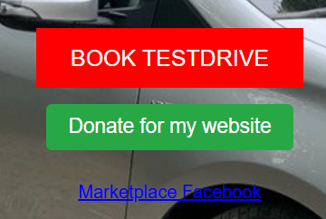

### Services section
* Booking a Test Drive
* Request for Buy
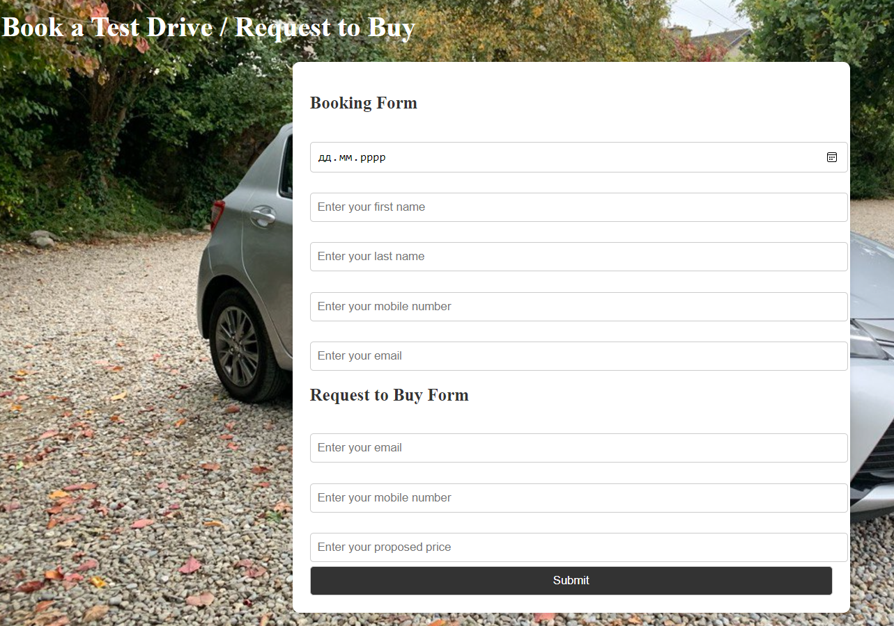

### Section Subscribe
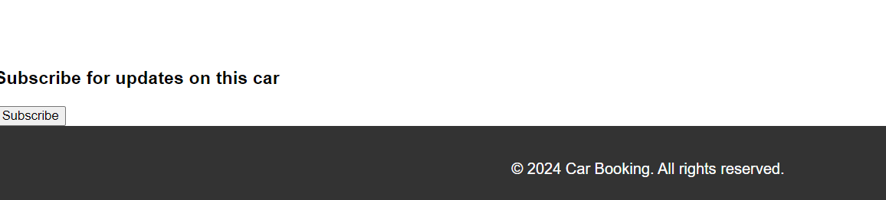

## Future Features

To further develop the idea of creating an application, it is necessary to add functionality and flexibility for adding car models. 
The idea of developing a flexible application for selling cars with the ability to book a test drive and set a price offer. 

## Testing

* Written tests and executed in tests.py

### Code Validation

* Use [CI Python Linter](https://pep8ci.herokuapp.com/)
* Get info fron CI Python Linter
 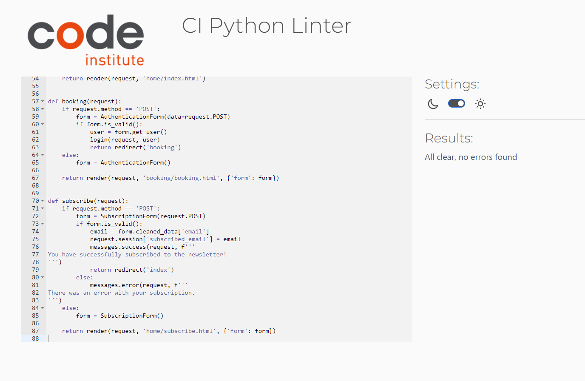 

### Bugs

#### Bugs Fixed

During the development of the application, there were bugs with the authorisation and logging in to the website. 
I had to look for different sources and watch all the videos by CodeInstitute. 
There are a lot of materials about Django embedded libraries. 

#### Known Bugs

* Test drive booking form does not complete successfully

Description: Users may encounter an issue where the test drive booking form does not complete successfully.

Solution: Make sure all required fields are filled in correctly and try again.

* The navigation menu is unresponsive

Description: Sometimes buttons and menus may not respond to clicks.

Solution: Refresh the page or try using a different browser.

* Images do not display correctly

Description: Some images may not display properly on different devices.

Solution: Make sure the images have the correct path and format.

* Slow server response

Description: Users may experience a slow server response when making requests.

Solution: Check your internet connection and try again. If the problem persists, contact your site administrator.

## Deployment

- The program was deployed to [Heroku](https://dashboard.heroku.com).

### To deploy the project as an application that can be **run locally**:

*Note:*
  1. This project requires you to have Python installed on your local PC:
  - `pip install python`

  1. You will also need pip installed to allow the installation of modules the application uses.
  - `pip install python3-pip`

Create a local copy of the GitHub repository by following one of the two processes below:

- Download ZIP file:
  1. Go to the [GitHub Repo page](https://github.com/lazoriks/car_booking).
  1. Click the Code button and download the ZIP file containing the project.
  1. Extract the ZIP file to a location on your PC.

- Clone the repository:
  1. Open a folder on your computer with the terminal.
  1. Run the following command
  - `git clone https://github.com/lazoriks/car_booking.git`

- Alternatively, if using Gitpod, you can click below to create your own workspace using this repository.

  

  1. Install Python module dependencies:
     
      1. Navigate to the folder madlib_with_python by executing the command:
      - `cd car_booking`
      1. Run the command pip install -r requirements.txt
        - `pip install -r requirements.txt`      

### To deploy the project to Heroku so it can be run as a remote web application:
- Clone the repository:
  1. Open a folder on your computer with the terminal.
  1. Run the following command
  - `git clone https://github.com/lazoriks/car_booking.git`

  1. Create your own GitHub repository to host the code.
  1. Run the command `git remote set-url origin <Your GitHub Repo Path>` to set the remote repository location to your repository.

  1. Push the files to your repository with the following command:
  `git push`
  1. Create a Heroku account if you don't already have one here [Heroku](https://dashboard.heroku.com).
  1. Create a new Heroku application on the following page here [New Heroku App](https://dashboard.heroku.com/apps):

      - 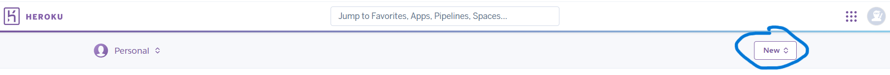

  1. Go to the Deploy tab:

      - 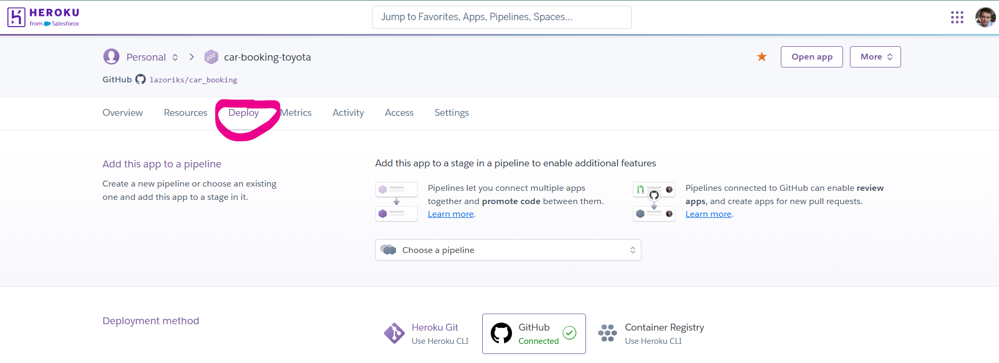

  1. Link your GitHub account and connect the application to the repository you created.

      - 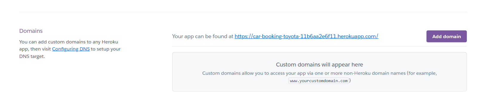

  1. Go to the Settings tab:
  
      - 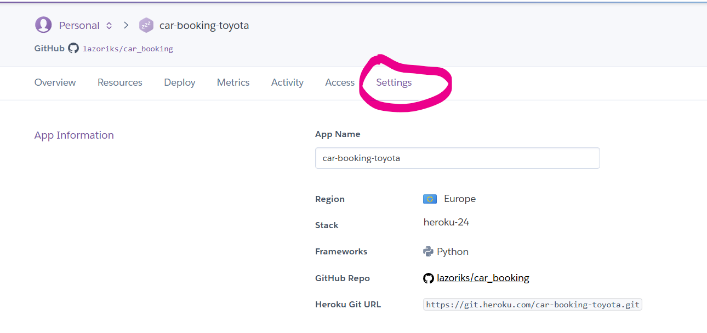

  1. Click "Add buildpack":

      - 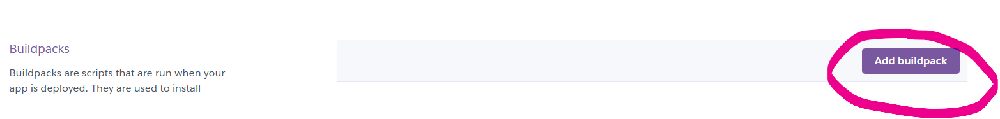

  1. Add the Python buildpacks in the following order:

      - 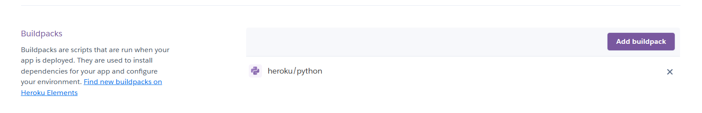

  1. Click "Reveal Config Vars."

      - 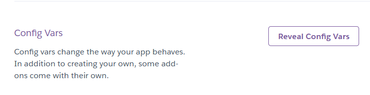

  1. Add 1 new Config Vars:
      - Key: PORT Value: 8000
      - *This Config was provided by [CODE INSTITUTE](https://codeinstitute.net/)*.

  1. Go back to the Deploy tab:

      - 

  1. Click "Deploy Branch":

      - 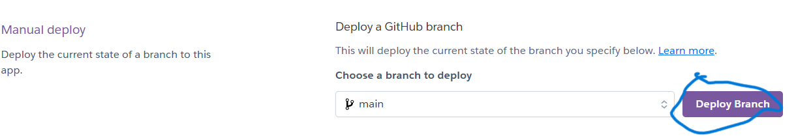

      - Wait for the completion of the deployment.

      - 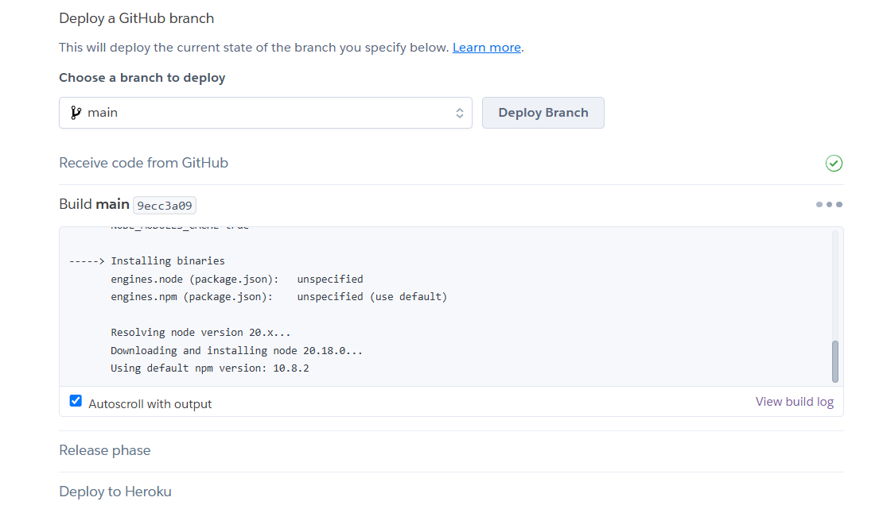

  1. Click "Open app" to launch the application inside a web page.

      - 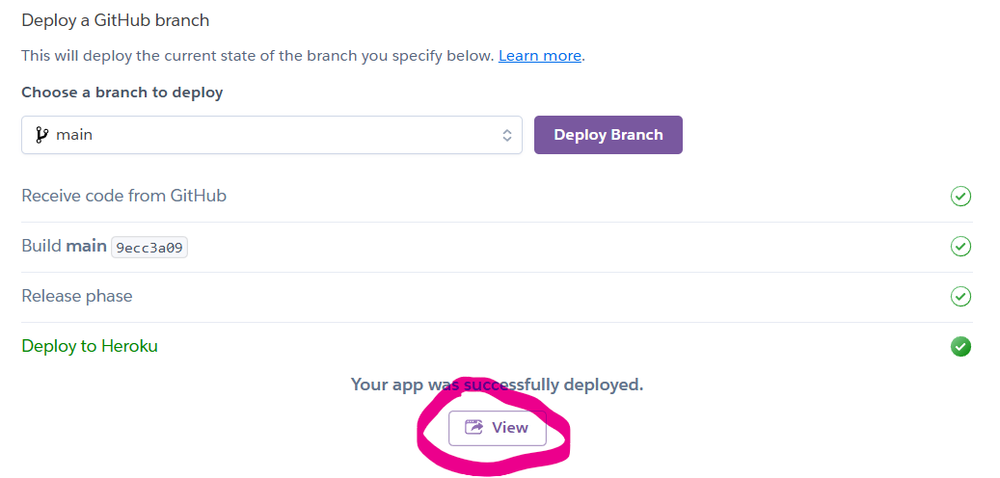

---

## Credits

### Content and text

* Main information from [Youtube video for example](https://www.youtube.com/watch?v=UiiqAo1fONc)
* Some information from [Youtube video for stripe](https://www.youtube.com/watch?v=oZwyA9lUwRk)

- [GitHub](https://github.com/) for giving the idea of the project's design.
- [Django](https://www.djangoproject.com/) for the framework.
- [Render](https://render.com/): for providing a free hosting.
- [Postgresql](https://www.postgresql.org/): for providing a free database.
- [Stripe](https://stripe.com/): for providing a free payment gateway.
- [Very Academy Youtube Channel](https://www.youtube.com/c/veryacademy): for brilliant tutorials, which shed the light on the implementation of database with multi-values products, precise explanations of the stripe API, and many other things!
- [Sitemap Generator](https://www.xml-sitemaps.com/): for providing a free platform to generate sitemaps.

### Media

* Open sites and sources of images and emblems(my own photos of my car)
* Code institute for the deployment process
* Translated with www.DeepL.com/Translator and Grammarly for Windows

### Acknowledgements
* Special thanks to [Julia Konovalova](https://github.com/IuliiaKonovalova) for the call and conversation that helped me, after the first unsuccessful attempt, to find the strength in the first place and to understand my shortcomings in the project and complete it. 
* Code Institute tutors and Slack community members for their support and help.

---

Happy coding!
